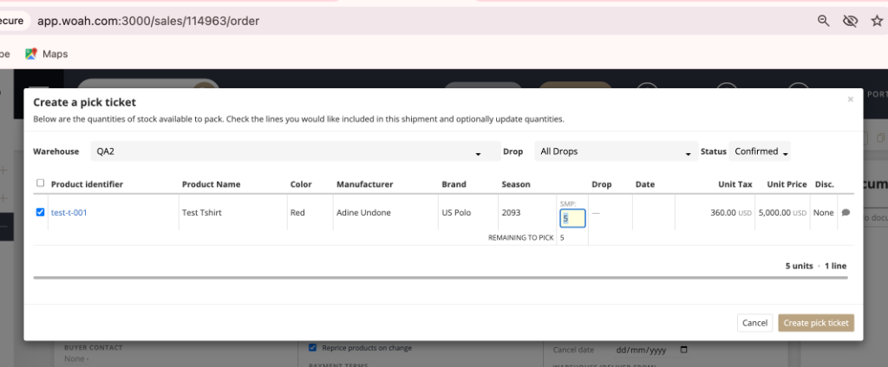

# 🎬 MRD CINEMA EDITZ - Creator Portfolio Platform



A full-stack, high-performance creator portfolio website built for **MRD CINEMA EDITZ** — tailored for cinematic vertical reels, commercial campaigns, video post-production services, and brand collaborations.

---

## 🌟 Tech Stack

### Backend
* **Ruby on Rails 8.1+ / Rails 7+ (API-only mode)**
* **Ruby 3.2.2**
* **MySQL / PostgreSQL** (via ActiveRecord & dotenv)
* **JWT Authentication** (`jwt`, `bcrypt` password hashing)
* **Authorization:** `pundit` policy gates for admin actions
* **Active Storage:** Direct image/video attachments + YouTube/Instagram embed support
* **Security & Spam Protection:** `rack-attack` rate-limiting & IP hashing for deduplicated views
* **Testing:** `rspec-rails` (13/13 passing specs)

### Frontend
* **React 19 (Vite)**
* **Tailwind CSS (v4)** with custom burnished gold metallic design system & CSS variables
* **React Router v6**
* **Lucide Icons** & **Canvas Confetti**
* **SEO & OpenGraph:** `react-helmet-async` for rich social preview cards on Instagram and WhatsApp
* **Axios** with JWT interceptors & session token tracking

---

## 🚀 Key Features

1. **Brand Aesthetic:** Built entirely around the 3D burnished gold, obsidian, and cinematic lens flare design system.
2. **Public Pages:**
   * **Home:** Hero section with tagline, stats ticker (50M+ views, 350K+ followers), featured reels showcase, partner brands carousel, client testimonials, and booking CTA.
   * **Portfolio / Videos Gallery:** Filter by categories (Cinematic Reels, Commercials, Color Grading, Music Videos, Travel), live search, duration badges, and pagination.
   * **Video Detail:** Responsive video player (9:16 vertical & 16:9 widescreen), view counters, interactive like/unlike, full comments section, report abuse, and related video recommendations.
   * **Services:** High-impact reels, commercial ads, Hollywood color science, and music video directing with quote request workflows.
   * **Media Kit:** Audience analytics, demographics charts, and one-click PDF media kit download.
   * **Contact / Hire Me:** Project booking form with budget selector, saved directly to database enquiries, with direct WhatsApp & Email contact channels.
   * **Floating WhatsApp Button:** Sticky bottom-left button with prefilled message configurable from the admin panel.
3. **User Engagement:**
   * User sign-up & login with JWT.
   * Like / unlike videos with instant optimistic UI.
   * Comment on reels, delete own comments, and report inappropriate comments.
   * Deduplicated video view counter (session + IP tracking per 24 hours).
4. **Admin Console (`/admin`):**
   * **Studio Dashboard:** Real-time metrics (Total Videos, Total Views, Likes, Unread Enquiries, Moderation alerts).
   * **Videos & Reels Manager:** Upload, edit, schedule, delete, and toggle featured reels.
   * **Categories Manager:** CRUD and ordering.
   * **Comments Moderation:** Approve, flag, delete comments, block users, and inspect visitor reports.
   * **Enquiries Inbox:** Manage client quote requests, mark as read/replied, and reply via email.
   * **Brands & Testimonials:** Manage client logos and director endorsements.
   * **Site Settings:** Edit WhatsApp number, social URLs, hero headlines, and media kit stats.

---

## 🔑 Login Credentials

* **Admin Account (Access to `/admin`):**
  * **Email:** `admin@mrdcinemaeditz.com`
  * **Password:** `Password123!`
* **Test Regular User Accounts:**
  * `alex@example.com` / `Password123!`
  * `elena@example.com` / `Password123!`

---

## 🛠️ Local Setup & Running

### 1. Backend Setup
```bash
cd backend
cp .env.example .env

# Install gems
bundle install

# Setup database
bundle exec rails db:create
bundle exec rails db:migrate
bundle exec rails db:seed

# Run RSpec test suite
bundle exec rspec

# Start backend server (Port 3001)
bundle exec rails s -p 3001 -b 127.0.0.1
```

### 2. Frontend Setup
```bash
cd frontend

# Install packages
npm install

# Start Vite development server (Port 5173)
npm run dev

# Build for production
npm run build
```

---

## 🌐 API Overview (`/api/v1`)

| Method | Endpoint | Description | Auth Required |
|---|---|---|---|
| `POST` | `/api/v1/auth/login` | Log in and receive JWT | No |
| `POST` | `/api/v1/auth/register` | Register new user | No |
| `GET` | `/api/v1/auth/me` | Current authenticated user profile | Yes |
| `GET` | `/api/v1/videos` | List published videos (filter, search, paginate) | No |
| `GET` | `/api/v1/videos/:id` | Video details, related videos, record view | No |
| `POST` | `/api/v1/videos/:id/like` | Toggle like/unlike | Yes |
| `POST` | `/api/v1/videos/:id/comments` | Post comment on reel | Yes |
| `POST` | `/api/v1/enquiries` | Submit client booking proposal | No |
| `GET` | `/api/v1/admin/dashboard` | Admin analytics & activity feed | Admin |
| `POST` | `/api/v1/admin/videos` | Create new video/reel | Admin |
| `PUT` | `/api/v1/admin/site_settings` | Bulk update site settings | Admin |

---

## 📄 License
Created for **MRD CINEMA EDITZ**. All rights reserved.
